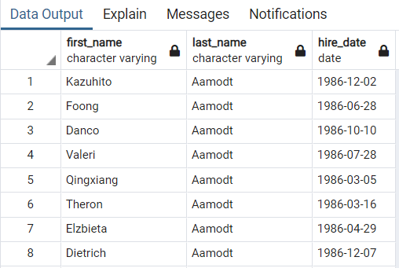

## Background 

It’s a beautiful spring day, and it’s been two weeks since i was hired as a new data engineer at Pewlett Hackard. My first major task is a research project on employees of the corporation from the 1980s and 1990s. All that remains of the database of employees from that period are six CSV files.

In this assignment, I will design the tables to hold data in the CSVs, import the CSVs into a SQL database, and answer questions about the data. 

To achieve this 3 steps need to be performed:

1. [Data Modeling](#data-modeling)
2. [Data Engineering](#data-engineering)
3. [Data Analysis](#data-analysis)

## Preperation 

1. Create a new repository for this project called `sql-challenge`

2. Clone the new repository to your computer.

3. Create a directory called 'EmployeeSQL' 

4. Add the 6 csv files to this folder.

5. Push these changes to GitHub.

## Main Task: 

## i. Data Modeling 

I started by reviewing the contents of the 6 csv files then sketched out an ERD (Entity Relationship Diagram) using the [QuickDBD](https://www.quickdatabasediagrams.com/) Web App:

I used this tool to list the Tables and thier Fields so that i could identify the Relasionships, Datatypes and Primary Keys.

## ii. Data Engineering 

The ERD is refined adding the relasionships between the individual Fields using Foriegn Keys to create a more detailed

[QuickDBD] creates an SQL which I exported, this code was used to create the Schemata using [pgAdmin](https://www.pgadmin.org/).

The data from each CSV file was imported to it's relevant SQL Table using the import tool. It is very important that the csv files are imported in the same order as the tables are created in the Schemata.

I also had to change the # - Locale and Formatting - datestyle setting in the postgressql.conf to datestyle = 'iso, mdy'  

## iii. Data Analysis 

I have been asked to 8 lists by my employer, i created a seperate query for each list.

The code and output is shown below:

1. List the following details of each employee: employee number, last name, first name, sex, and salary.

SELECT  e.emp_no,
        e.last_name,
        e.first_name,
        e.sex,
        s.salary
FROM employees as e
    LEFT JOIN saleries as s
    ON (e.emp_no = s.emp_no)
ORDER BY e.last_name;

2. List first name, last name, and hire date for employees who were hired in 1986.

SELECT first_name, last_name,hire_date 
FROM employees
WHERE hire_date 
BETWEEN '1986-01-01' 
AND '1986-12-31'
ORDER BY last_name;

3. List the manager of each department with the following information: department number, department name, the manager's employee number, last name

SELECT	dm.dept_no,
		d.dept_name,
		dm.emp_no,
		e.last_name,
		e.first_name
FROM	dept_manager AS dm
	INNER JOIN departments AS d
	ON (dm.dept_no = d.dept_no)
	INNER JOIN employees AS e
	ON (dm.emp_no = e.emp_no)
ORDER BY d.dept_name;

4. List the department of each employee with the following information: employee number, last name, first name, and department name.

SELECT	e.emp_no,
		e.last_name,
		e.first_name,
		d.dept_name
FROM employees AS e
	INNER JOIN dept_emp AS de
	ON (e.emp_no = de.emp_NO)
	INNER JOIN departments AS d
	ON (de.dept_no = d.dept_no)
ORDER BY e.last_name;

5. List first name, last name, and sex for employees whose first name is "Hercules" and last names begin with "B."

SELECT	First_name,
		last_name,
		sex
FROM employees
WHERE first_name ='Hercules'
AND last_name LIKE 'B%'
ORDER BY last_name;

6. List all employees in the Sales department, including their employee number, last name, first name, and department name.

SELECT	e.emp_no,
		e.last_name,
		e.first_name,
		d.dept_name
FROM employees AS e
	INNER JOIN dept_emp AS de
	ON (e.emp_no = de.emp_no)
	INNER JOIN departments AS d
	ON (de.dept_no = d.dept_no)
WHERE d.dept_name = 'Sales'
ORDER BY e.last_name;

7. List all employees in the Sales and Development departments, including their employee number, last name, first name, and department name.

SELECT	e.emp_no,
		e.last_name,
		e.first_name,
		d.dept_name
FROM employees AS e
	INNER JOIN dept_emp AS de
	ON (e.emp_no = de.emp_no)
	INNER JOIN departments AS d
	ON (de.dept_no = d.dept_no)
WHERE d.dept_name IN ('Sales', 'Development')
ORDER BY e.last_name;

8. List the frequency count of employee last names (i.e., how many employees share each last name) in descending order.

SELECT last_name,
COUNT(last_name)
FROM employees
GROUP BY last_name
ORDER BY COUNT(last_name)
DESC;

## Submission

* Create an image file of your ERD.

* Create a `.sql` file of your table schemata.

* Create a `.sql` file of your queries.

* Create and upload a repository with the above files to GitHub and post a link on BootCamp Spot.

* Ensure your repository has regular commits and a thorough README.md file

## Rubric

[Unit 9 Homework Rubric](https://docs.google.com/document/d/1OksnTYNCT0v0E-VkhIMJ9-iG0_oXNwCZAJlKV0aVMKQ/edit?usp=sharing)
